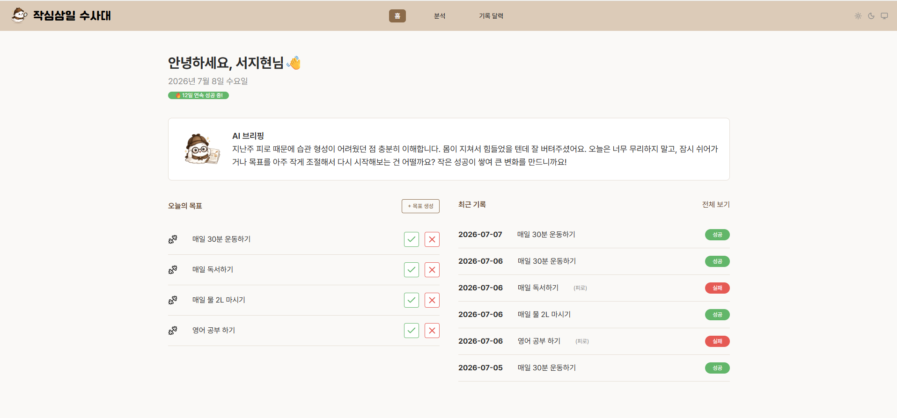
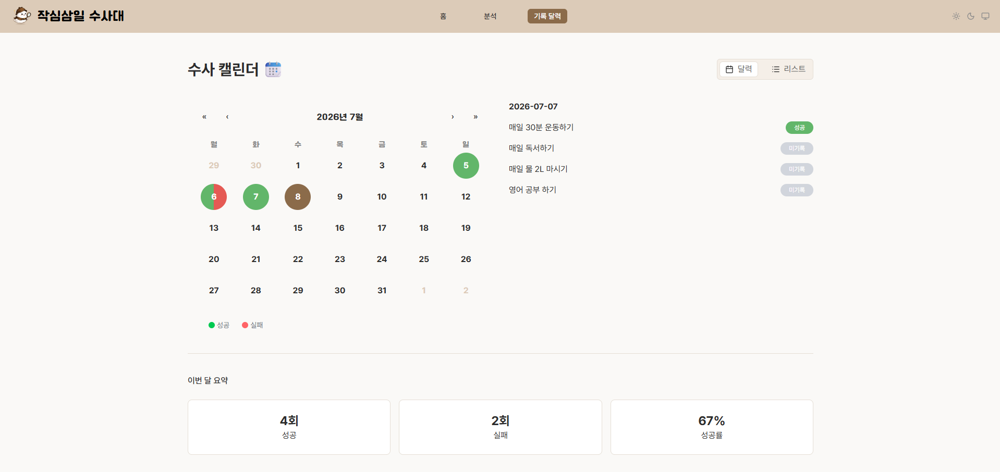
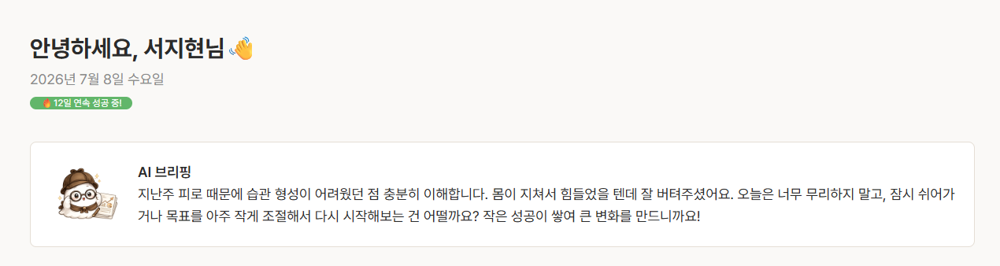
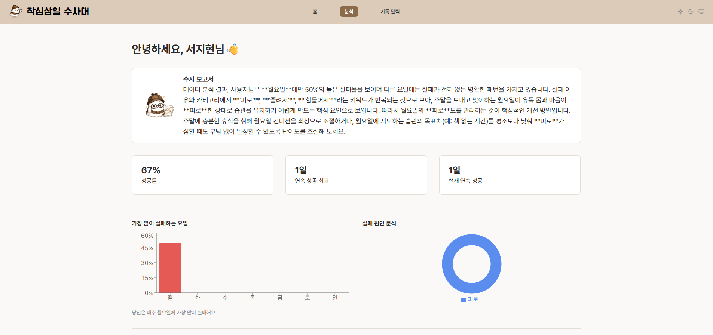

# 작심삼일 수사대 - Frontend

AI가 목표 실패 원인을 분석해 탐정처럼 브리핑해주는 목표 관리 서비스의 프론트엔드입니다.

## 🔗 링크

- 🌐 서비스 바로가기: [\[배포 URL\]](https://jakshim-frontend-one.vercel.app/)
- 💻 Backend 레포: [\[링크\]](https://github.com/jakshim-susa/jakshim-backend)

## 🛠️ 기술 스택

- **Language**: TypeScript
- **Framework**: React
- **Styling**: Tailwind CSS
- **State Management**: Zustand

## ✨ 주요 기능

- 카카오 소셜 로그인
- 목표 생성 및 관리
- 성공/실패 기록 (실패 사유 입력)
- AI 수사 브리핑 결과 화면
- 성공률/실패 패턴 분석 대시보드
- 반응형 UI (PC / 모바일 대응)

## 🖼️ 화면 미리보기

**1. 홈 / 목표 관리**

사용자가 목표를 등록하고 관리하는 메인 화면

**2. 사건 보고 (성공/실패 기록)**

성공/실패 기록 및 실패 사유 입력

**3. AI 수사 브리핑**

AI가 탐정 시점으로 분석 결과 제공

**4. 분석 대시보드**

성공률, 실패 패턴 시각화

## 📁 폴더 구조

```
src/
├── api/ # 백엔드 API 통신
├── assets/ # 이미지, 폰트 등 정적 자원
├── components/ # 재사용 UI 컴포넌트
├── layouts/ # 공통 레이아웃
├── pages/ # 라우트별 페이지
├── store/ # Zustand 상태 관리
├── styles/ # 전역 스타일
├── types/ # TypeScript 타입 정의
└── utils/ # 공통 유틸 함수
```

| 폴더          | 설명                                |
| ------------- | ----------------------------------- |
| `api/`        | 백엔드와의 API 통신 로직            |
| `assets/`     | 이미지, 아이콘, 폰트 등 정적 자원   |
| `components/` | 재사용 가능한 UI 컴포넌트           |
| `layouts/`    | 헤더/푸터 등 공통 레이아웃 컴포넌트 |
| `pages/`      | 라우트에 매핑되는 페이지 컴포넌트   |
| `store/`      | Zustand 기반 전역 상태 관리         |
| `styles/`     | Tailwind 설정 및 전역 스타일        |
| `types/`      | TypeScript 타입/인터페이스 정의     |
| `utils/`      | 공통 함수, 헬퍼                     |

## 🚧 진행 상황

**✅ 구현 완료**

- 카카오 로그인 연동
- 목표 생성
- 성공/실패 기록 (실패 사유 입력)
- AI 수사 브리핑 화면
- 분석 대시보드
- 반응형 UI
- 라이트/다크 테마

**📋 추가 개발 예정**

- 로그아웃
- 목표 수정/삭제/종료
- 메모 작성
- 캐릭터 성장

## 📄 관련 문서

프로젝트 소개, 기획 문서(Figma, 기능정의서 등)는 [\[노션 페이지\]](https://jaksim3il.notion.site/37c01887c58f80978dd8c7bcf39ce0ba)에서 확인하실 수 있습니다.
